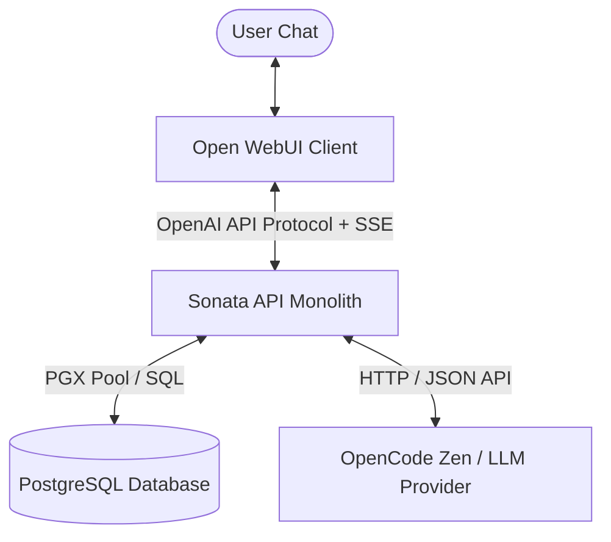
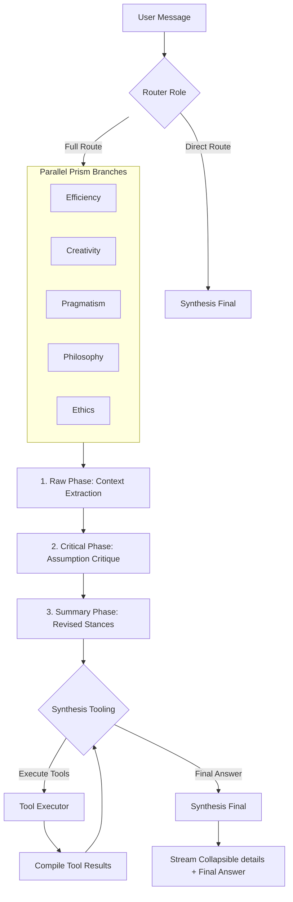
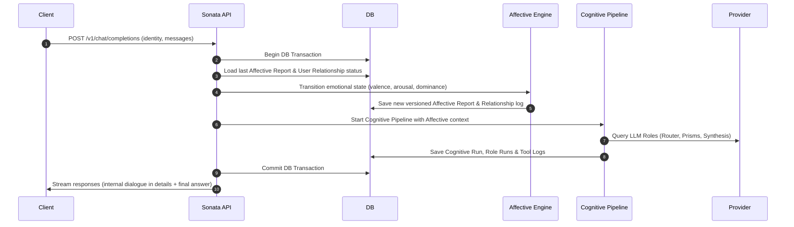

# Sonata: Cognitive Architecture & Affective Dynamics Engine

Sonata is a powerful agentic cognitive monolith built in Go. It implements an advanced 18-step parallel reasoning pipeline (Prisms) and real-time emotional state transitions (Affective Dynamics), exposing a mock OpenAI-compatible streaming API to integrate seamlessly with clients like **Open WebUI**.

---

## 🏗️ System Architecture

Sonata consists of the following key components:



1. **Open WebUI (Frontend)**: Serves as the user-facing chat interface. It communicates with Sonata API using the standard OpenAI completions protocol.
2. **Sonata API Monolith (Backend)**: Orchestrates the database transactions, calculates affective state transitions, coordinates the 18-step cognitive pipeline, and streams responses.
3. **PostgreSQL (Neon)**: The canonical storage layer containing conversational history, versioned affective reports, cognitive runs, role run logs, tool records, and custom user prompts.
4. **LLM Provider (OpenCode Zen)**: The inference engine powering the individual agent roles.

---

## 🧠 Cognitive Pipeline (18-Step Reasoning)

When a request is routed through the **Full Cognitive Route**, Sonata spins up a multi-agent dialogue that processes the input in parallel branches called **Prisms**:



### 18 Orchestrated Role Runs:
- **Router (1 run)**: Decides whether the prompt needs `direct` or `full` processing.
- **Prism Branches (15 runs)**: 5 Prisms (Efficiency, Creativity, Pragmatism, Philosophy, Ethics) each executing 3 sequential phases:
  1. *Raw Phase*: Extract context, perspectives, and potential positions.
  2. *Critical Phase*: Challenge assumptions and point out weaknesses/biases.
  3. *Summary Phase*: Produce a balanced, revised stance and calculate confidence.
- **Synthesis Tooling (1+ runs)**: Aggregates the prism summaries and decides whether to run external tools.
- **Synthesis Final (1 run)**: Compiles the final response based on all summaries and tool execution outputs.

---

## 🎭 Affective Dynamics & HTTP Flow

Every request initiates a database transaction that calculates and records emotional transitions before executing LLM completions:



1. **Valence/Arousal/Dominance**: Dynamics are calculated based on mathematical models, scaling factors, and past interactions.
2. **User Relationship**: Tracks trust and rapport scores, modifying emotional projections.
3. **Graceful Degradation**: If the emotional layer fails, the chat continues seamlessly with a degraded fallback report.

---

## 🛠️ Tech Stack & Structure

- **Backend**: Go 1.22+ (using `chi` router, `pgx/v5` connection pool, `sqlc` query generator).
- **Database**: PostgreSQL 16 (Neon-compatible canonical schema).
- **Migration tool**: `goose` for schema upgrades.
- **Inference client**: Custom OpenAI/OpenCode Zen model provider with usage logging.

### Repository Layout:
```text
Sonata/
├── cmd/sonata/          # CLI and API server entry points
├── config/              # YAML config profiles (base, production, local)
├── docs/                # Project documentation
│   ├── mini-mvp/        # Canonical specifications for the mini-MVP
│   └── stage-*/         # Architectural designs for long-term Sonata
├── internal/
│   ├── application/     # Orchestrators and HTTP handlers
│   ├── cognition/       # Core Cognitive Pipeline abstractions
│   ├── database/        # Database repositories and Goose migrations
│   ├── emotion/         # Affective Dynamics engine
│   ├── protected/       # Protected instruction loaders and manifest resolvers
│   └── provider/        # LLM client abstractions
├── Dockerfile           # Multi-stage Docker build
└── docker-compose.yml   # Local database, migrations, and API stack
```

---

## 🚀 Getting Started

### Prerequisites
- [Go 1.22+](https://go.dev/)
- [Docker](https://www.docker.com/) & Docker Compose
- API Keys for OpenCode Zen/OpenAI provider

### Running Locally with Docker Compose

1. Clone the repository and navigate to the directory.
2. Build the containers:
   ```bash
   docker compose build
   ```
3. Start the stack (this launches PostgreSQL, executes database migrations, and boots the API server):
   ```bash
   docker compose up
   ```
4. Verify the server is ready:
   ```bash
   curl http://localhost:8080/internal/health/ready
   ```
   Should return: `{"status":"ok"}`

### Running Tests

Run unit and repository integration tests (requires `DATABASE_URL` environment variable for integration tests, otherwise database tests will skip gracefully):
```bash
go test -v ./...
```

---

## 📚 Documentation Reference

- [Architecture & Boundaries](file:///f:/projects/Sonata/docs/mini-mvp/ARCHITECTURE.md)
- [Technical Stack & Models](file:///f:/projects/Sonata/docs/mini-mvp/TECH_STACK.md)
- [Affective Dynamics Specification](file:///f:/projects/Sonata/docs/mini-mvp/modules/AFFECTIVE_DYNAMICS.md)
- [Implementation Plan](file:///f:/projects/Sonata/docs/mini-mvp/implementation_plan.md)
